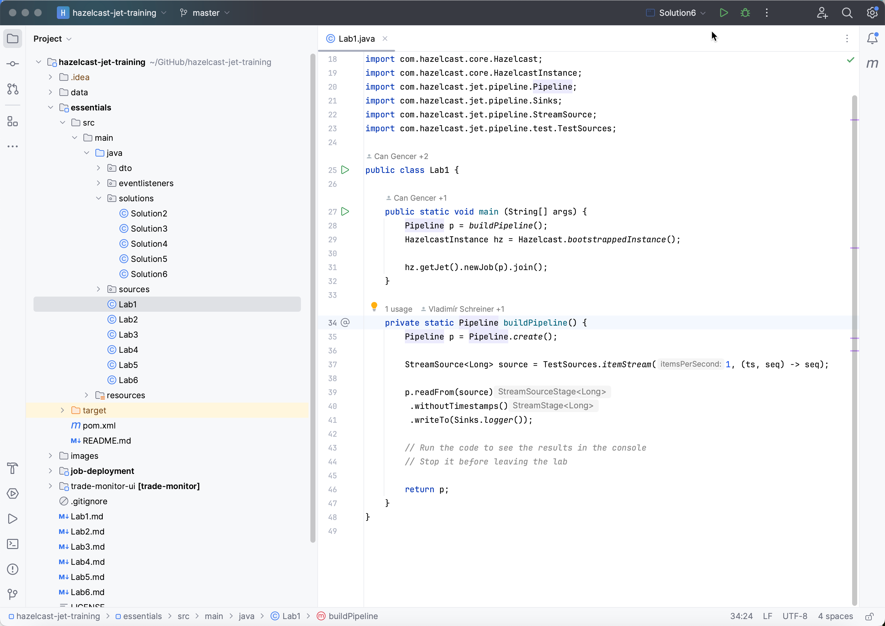
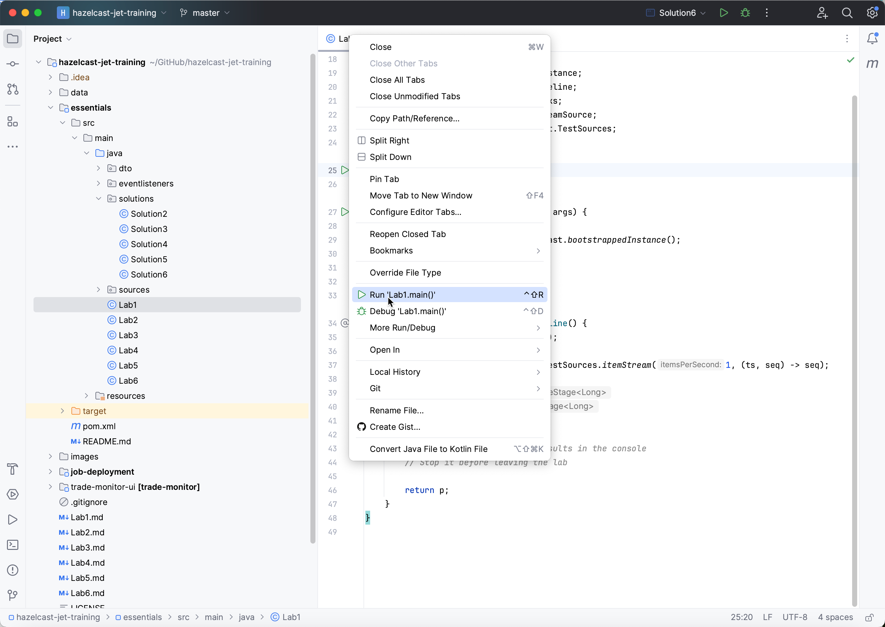
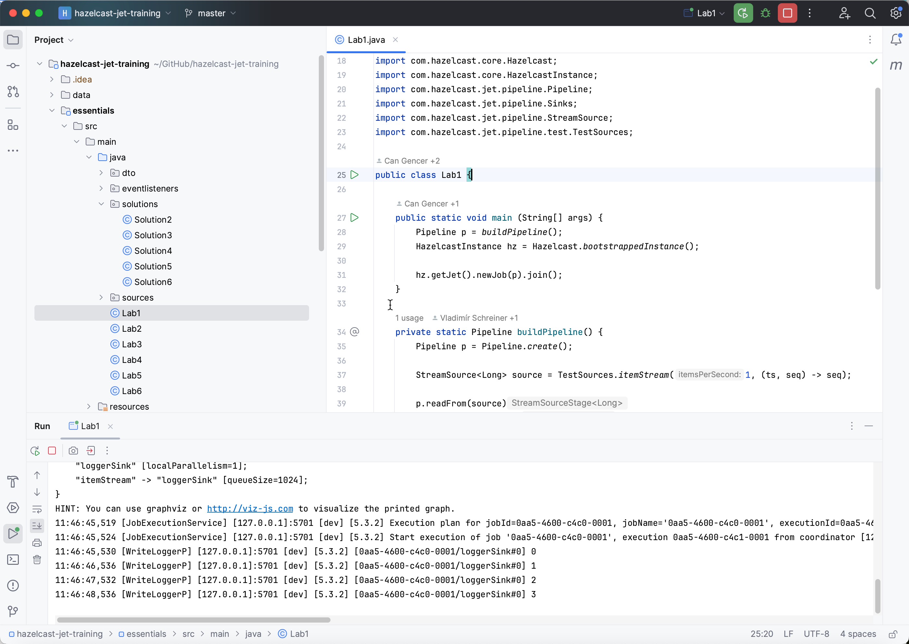
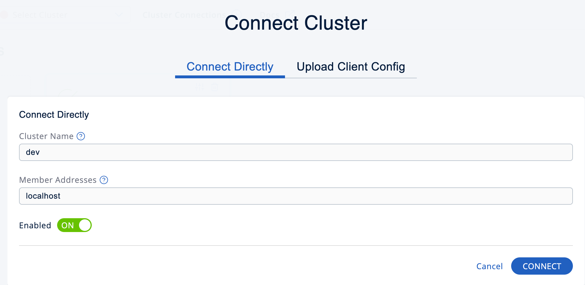
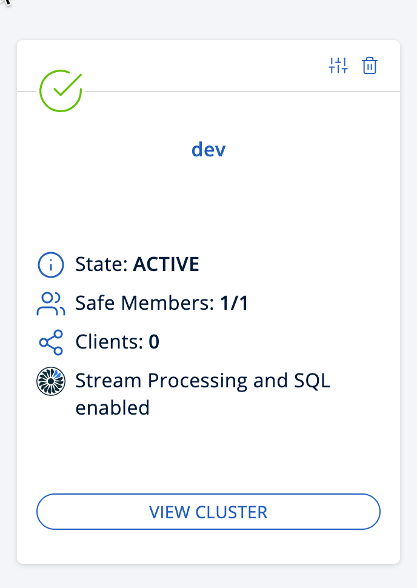
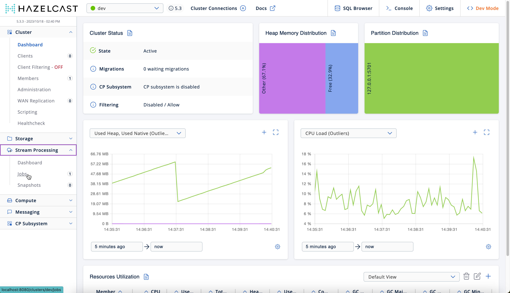
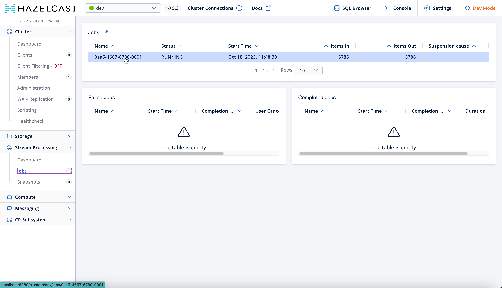
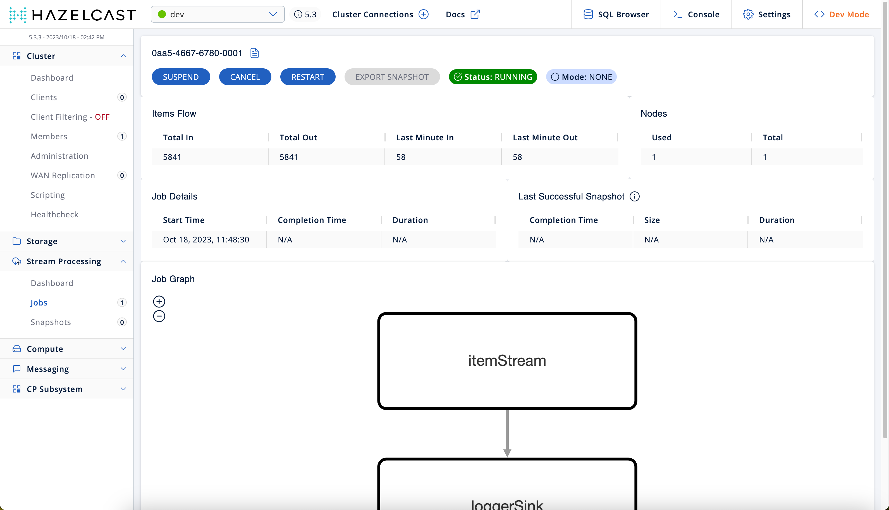
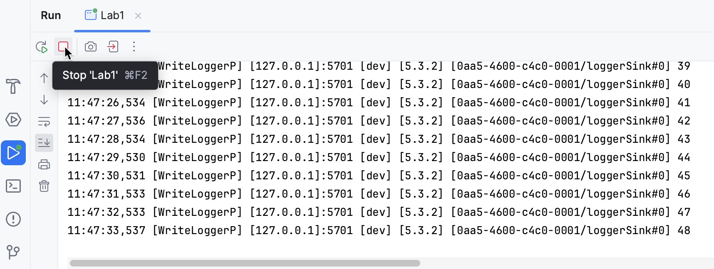

# Lab 1

## Objectives 

* Validate lab environment
* Use Management Center to manage and monitor job
* Use Hazelcast CLI to manage and monitor job

## Steps

1. Open `Lab1` file in the `essentials` module 

 

2. Run Lab 1. 

 

You will see the logger output in the `Run` tab.

 

3. In your browser, go to [Installing the Hazelcast CLC](https://docs.hazelcast.com/clc/latest/install-clc) and follow the instructions for your operating system.

4. Open a terminal window, navigate to the `.hazelcast/config directory`, and make a new directory called `dev`.

5. In this new directory, create a file called `config.yaml`. Add the following lines to the file.
```yaml
cluster:
  name: "dev"
  address: "localhost:5701"
```

6. Use `clc job -h` to see the list of available job-related commands.

```console
% clc job -h
Jet job operations

Usage:
  clc job [command] [flags]

Available Commands:
  cancel          Cancels the job with the given ID or name
  export-snapshot Exports a snapshot for a job
  list            List jobs
  restart         Restarts the job with the given ID or name
  resume          Resumes a suspended job
  submit          Submits a jar file to create a Jet job
  suspend         Suspends the job with the given ID or name

Flags:
  -h, --help   help for job

Global Flags:
  -c, --config string      set the configuration
  -f, --format string      set the output format, one of: csv, delimited, json, table (default "delimited")
      --log.level string   set the log level (default "info")
      --log.path string    set the log path, use stderr to log to stderr (default "/Users/happleton/.hazelcast/logs/2023-10-18.log")
  -q, --quiet              disable unnecessary output
      --timeout string     timeout for operation to complete
      --verbose            enable verbose output

Use "clc job [command] --help" for more information about a command.
```
8.  Use the CLC to get cluster information, display the list of jobs, then suspend the job. You will need to include the cluster configuration you created in Step 5, using the -c option. Example:

```console
% clc -c dev job list
0aa5-4667-6780-0001	N/A	RUNNING	2023-10-18 11:48:30	-
OK
```

9. Verify that the job has been suspended by looking at the output in the IDE `Run` window. Use the CLC to resume the job.

> Note: When you suspend, then resume your job, the integer value will reset to 1, effectively restarting the job. This is because this source and sink do not support snapshots, which are required for jobs to be resumable from the suspend point. 


10. In your browser, go to [Installing Management Center](https://docs.hazelcast.com/management-center/5.3/getting-started/install) and follow the instructions for your operating system. (Do not use Docker for this lab.) 

11. In your browser, open [localhost:8080](http://localhost:8080). Select Dev as the authentication method.

12. Add a cluster using the following parameters:
* Cluster name: dev
* Address: localhost



13. Click on `View Cluster`.





14. Go to `Stream Processing > Jobs`. Click on the running job. 






15. Use Management Center to suspend your job. Examine the screen output. Resume the job and examine the screen output. 

16. Click on the red `stop` button next to the `Run` window to stop the execution of Lab1. 

