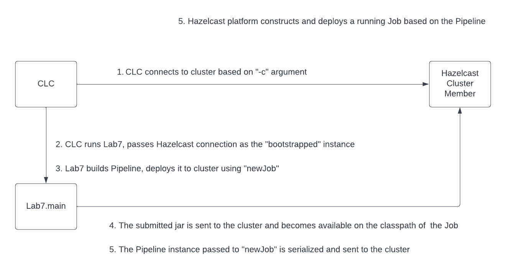

# Lab 7 - Deploying Your Pipeline

So far, all the labs have been run in embedded mode, which is convenient for development 
but typically, a Hazelcast cluster will already be running, and you will need to deploy 
your job to it.  Deploying to a remote cluster introduces some new complications that 
you will need to understand.  That is the subject of this lesson.

## Objectives 
* Package your job for deployment to a remote cluster
* Submit a job to a remote cluster using the Hazelcast CLC
* Write a client that submits a job
* Stream results from a job back to the client that submitted it

> __NOTE:__
>
> if you are having trouble, we provide an example solution in the `Solutions`
> directory.

## Instructions

#### 1. Start a remote cluster
Before beginning, run `mvn clean package`.

For the purpose of this lab, we will use Docker to run a "remote" cluster.  We will 
also run `TradeSource` as a client so that we will have some trades
to process.

```shell
cd hazelcast-platform-labs-docker
docker compose up -d
```

Navigate to http://localhost:8080 in your browser and verify that you can access 
Hazelcast Management Center.  Use management center to verify that there is a 2 node 
cluster and that the "trades" map is being updated.


> __NOTE:__ it may take a minute or so for Management Center to see both cluster members.

##### Extra Credit
The CLC configuration you created in Lab 1 should also work for this cluster, because 
, even though it is running in Docker, one of the instances has a port mapping to 
localhost:5701.  Use CLC to check the size of the "trades" map.  The name of this 
cluster configuration is "local". Tell CLC which cluster to use with  the "-c" argument 
as show below.

```shell
clc -c local map size  --name trades
```

#### 2. Package your job for deployment

The best way to package your job for deployment to a remote cluster is using an "uber jar" 
created by the maven shade plugin.

However, there are a couple of important caveats: 
- classes with package names beginning with `com.hazelcast` cannot be deployed in a job
- the `com.hazelcast` classes are already available on the Hazelcast cluster, so do not to 
include them in your jar file. 

The best way to package your job is to use the shade plugin and list the hazelcast 
dependency with `provided` scope to keep it from being included in the uber jar.
Unfortunately, making the hazelcast dependency `provided` does not work well for 
local development.  In this lab, we have used maven profiles to resolve the conflict.

Review `pom.xml` in the `hazelcast-platform-labs` directory then, build the jar for 
release as shown below.

```shell
# in hazelcast-platform-labs
mvn package -Drelease
```

#### 3. Deploy your jar using CLC

It is important to understand how the deployment process works.  In all 
the previous examples, client and server code have been mixed making 
it difficult to tell what is running where.  The diagram below shows 
how the CLC based deployment process works.



When you are ready, submit your job to the remote cluster using CLC.
```shell
# in hazelcast-platform-labs
clc -c local job submit target/hazelcast-platform-labs-5.0-SNAPSHOT.jar --class Lab7 --name Lab7 --wait
```

You can now use CLC or Management Center to verify that the job is running.
```shell
clc -c local job list
```

Also, since this job just reads trades and writes them to a log, you should 
be able to see the output in the logs of both members of the remote cluster.

```shell
# in hazelcast-platform-labs-docker
docker compose logs --follow hazelcast-1 hazelcast-2 
```

#### 4. Modify Lab7 to deploy itself without CLC and use an Observable to receive streamed results

Typically, it is easier to use CLC to deploy a job to a remote cluster.
That approach allows you to move from developing to deploying without 
changing the code.  However, there may be times when you want to 
deploy a job programmatically.  That is what we will do in this part.

Also, there is a special `Sink` which can be used to stream the results 
of a job back  to a client. First read the documentation for 
[Sinks.observable](https://docs.hazelcast.org/docs/5.3.5/javadoc/com/hazelcast/jet/pipeline/Sinks.html#observable-com.hazelcast.jet.Observable-)
 modify the lab 7 code to send the results back to the client.

Note that in this case, you will not be able to rely on CLC for the 
connection to the cluster.  The program will need to create a client 
connection.  There are _many_ ways to configure a client.  The 
recommended approach is to use 
`HazelcastClient.newHazelcastClient()` which follows a documented 
process for finding a client configuration. See 
[the documentation page](https://docs.hazelcast.com/hazelcast/5.3/configuration/understanding-configuration)
, especially "Configuration Precedence".  For this lab, a client configuration file has 
been provided: `hazelcast-client.yaml`

Also, when a client submits a job, it needs to attach all  required
classes using [JobConfig.addClass](https://docs.hazelcast.org/docs/5.3.5/javadoc/com/hazelcast/jet/config/JobConfig.html).
When using CLC, this is taken care of automatically.

Complete the code by following the instructions in `Lab7.java` then 
test it by running it from the IDE.

## Additional Notes

You can run _Management Center_ with

`docker run -d -p 8080:8080 hazelcast/management-center`.

To connect to your cluster, use

cluster name: `dev`

member address: `host.docker.internal`
