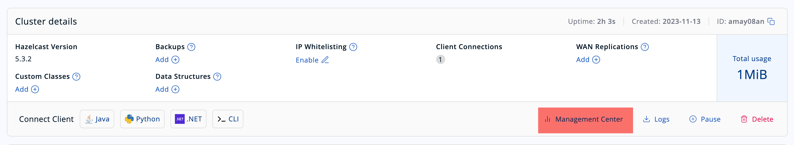

# Lab 7 - Deploying Your Pipeline

So far, all the labs have been run in embedded mode, which is convenient for development 
but typically, a Hazelcast cluster will already be running, and you will need to deploy 
your job to it.  Deploying to a remote cluster introduces some new complications that 
you will need to understand.  That is the subject of this lesson.

## Objectives 
* Package your job for deployment to a remote cluster.
* Write a client that submits a job.
* Stream results from a job back to the client that submitted it.
* Submit a job using the Hazelcast CLC

## Instructions

#### 1. Start a remote cluster
Before beginning, run `mvn clean package`.

For the purpose of this lab, we will use Docker to run a "remote" cluster.

`docker compose up -d`

Navigate to http://localhost:8080 in your browser and verify that you can access 
Hazelcast Management Center.  Use management center to verify that there is a 2 node 
cluster.

> __NOTE:__ it may take a minute or so for Management Center to see both cluster members.

#### 2. Package your job for deployment

The best way to package your job for deployment to a remote cluster is using an "uber jar" 
created by the maven shade plugin.

However, there are a couple of important caveats: 
- classes with package names beginning with `com.hazelcast` cannot be deployed in a job
- the `com.hazelcast` classes are already available on the Hazelcast cluster, so do not to 
include them in your jar file


## Part 1: Set Up Environment

1. Browse to [viridian.hazelcast.com](https://viridian.hazelcast.com). Create an account, then log in. Create a production cluster.

2. In the Quick Connect guide, select CLI and follow the instructions to install and configure the Hazelcast Command Line Client.

3. Verify that there are no jobs currently running.
```shell
\job list
```
4. Exit CLC.
```shell
\exit
```

## Part 2: Build Your Code

1. (whatever steps are needed to build the code)

## Part 3: Submit Your Code

1. (first submission should have missing class info)

```shell
clc -c <your-cluster> job submit <filename.jar>
```
2. (what troubleshooting tools are available to see what went wrong?)

3. Include the class in your submit command.
```shell
clc -c <your cluster> job submit <filename.jar> --class <path>
```

4. Verify that the job is running.
```shell
clc -c <your cluster> job list
```

5. In the Viridian dashboard, open Management Center. Go to Stream Processing > Dashboard


 
 (screen shot of jobs dashboard)

 (What are we looking for/at? Any potential problems we can identify here?)

6. Go to Stream Processing > Jobs, then open the detailed view of your job.

(what are we looking for/at? Any potential problems we can identify here?)

